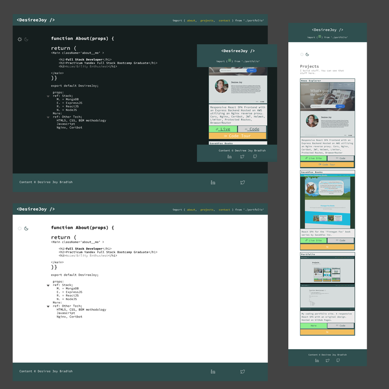

# Desiree Joy Bradish REACTJs Portfolio

[Live Link](https://desireejoy.github.io/DesireeJoy_Portfolio/)

## Technology

- This project is based in REACT.
- Utilizes BEM methodology for code readability & easy maintenance.
- Dynamically imports data from easily updatable JSON files.

### Screenshots

#### Sample Code

    function Projects(props) {
           return(
            <>
            <h1 className='projects__heading'>Projects</h1>
            <h2 className={`projects__subheading ${props.theme === 'dark' ? 'projects__subheading-dark': ''}`}>
            I build stuff. You can see that stuff here.</h2>
            

            

            {projectList.slice(0,props.projectsShown).map((proj, index) => (
            <Project 
                title={proj.title} 
                image={proj.image} desc={proj.desc} 
                live={proj.live} link={proj.link} 
                video={proj.video} alt={proj.alt} />
            ))}
            

            

            </>
            )}
